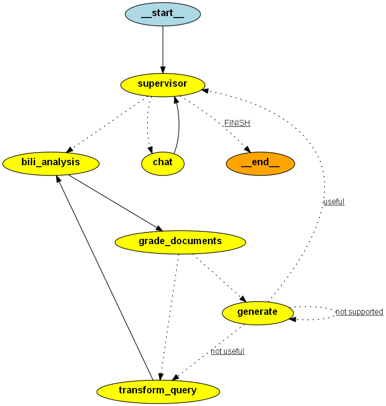
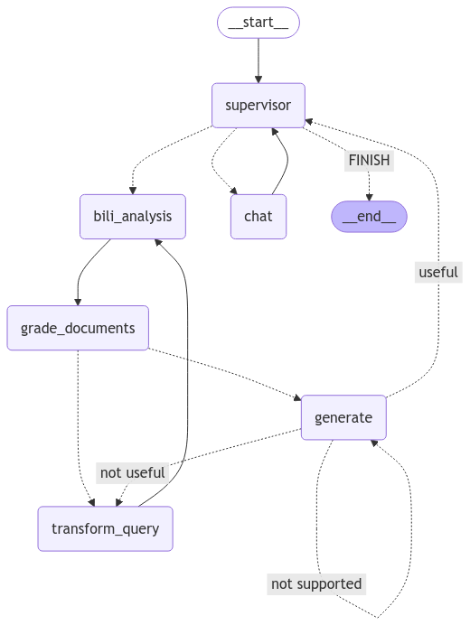

# AI-Agent-Demo
## 1. BiliAgent
  这是一个关于推荐b站视频的Agent。用户输入需求，由大模型进行理解，提取出需要查询的query，再利用bili-api工具，根据query进行视频查询，最后返回查询结果。根据结果构建RAG，并提取出关键信息。再由Agent分别判断每个视频与用户问题的相关性等问题，最后回答用户问题。\
框架：LangGraph, LangChain, FastAPI

## 2. ReAct_AI_Agent
  这是利用提示工程和ReAct机制构建的客服Agent, 其中仅涉及基础大模型的调用。工具调用, 思考过程传递等是由开发者手动实现的, 未使用Agent框架。

## 3. game_builder_crew
  一个Crewai框架构建的Multi-Agent, 能够实现游戏的策划, 代码编写, 代码优化等过程。（目前效果一般）

## 4. surprise_travel
  一个Crewai框架构建的Multi-Agent, 能够完成互联网查询等功能，进行旅游策划。

## 5. Multi-Agent
### 5.1 Introduction
  这是一个在BiliAgent基础上构建的多智能体。目前已完成原始框架的修改, 能够方便接入多个Agent。同时在BiliAgent基础上, 将它修改为一个对话式的Multi-Agent。 
  
  **当前功能**：
  - 对话式的聊天机器人;
  - 调用Bili-API查询B站视频信息, 包括名称, 简介, 点赞数, 链接等信息, 然后通过多个Agent进行信息处理, 包括RAG, 内容审查等信息;
  - 调用Arxiv-API查询Arxiv网站论文信息, 包括论文的摘要, 标题, 发表日期等信息, 然后通过Agent对信息进行理解和处理, 并给出用户合理的回答。
  
  **后续需要增加**：
  - 消息的发送, 利用QQ邮箱等服务
  - 联网功能, 获取最新新闻和资讯

### 5.2 FrameWork
  **Multi-Agent基于技术**：LangGraph, LangChain, LangServe 和 FastAPI. 
  **目前支持API**：OpenAI在线大模型API调用

### 5.3 Project Show
  <video width="60%" height="auto" controls>
  <source src="./Multi-Agent/video/video.mp4" type="video/mp4">
</video>

### 5.4 Multi-Agent结构图
  
  

